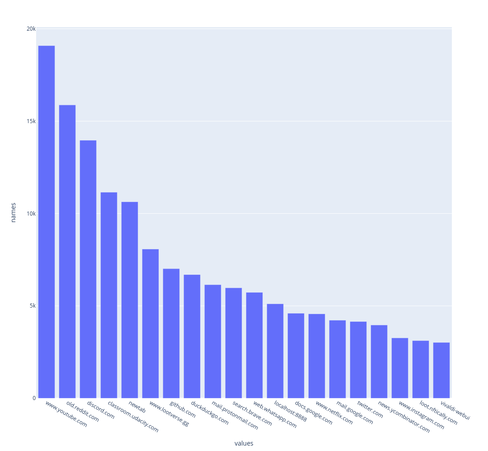

## [ActivityWatch](https://github.com/ActivityWatch/activitywatch) meets jupyter-notebooks

The purpose of this repo is to showcase the various ways I querried my [ActivityWatch](https://github.com/ActivityWatch/activitywatch).

My goal is to generate a graph of the websites I go to the most similar to the ['Top Browser Domains' feature](https://github.com/ActivityWatch/aw-webui/commit/8f443bc1e258c54f1838994e0f1f79e254d86d6a) but like [another person I can not get it working.](https://github.com/ActivityWatch/aw-webui/issues/357). I look forward to whenever 0.12.0 get's released.

## Explanation of files

First I coppied the sqlite database from [the data directory](https://docs.activitywatch.net/en/latest/directories.html#data-directory) and played with it within [QueryCrafting.ipynb](./QueryCrafting.ipynb) and [GraphingUp.ipynb](GraphingUp.ipynb). Inside [QueryCrafting.ipynb](./QueryCrafting.ipynb) I wrote and troubleshooted a query get all the domain names and group them distinctly. I then used the query from [QueryCrafting.ipynb](./QueryCrafting.ipynb) inside [GraphingUp.ipynb](GraphingUp.ipynb) to generate a graph using [plotly](https://plotly.com/python/bar-charts/).

While troubleshooting ['Top Browser Domains' feature](https://github.com/ActivityWatch/aw-webui/commit/8f443bc1e258c54f1838994e0f1f79e254d86d6a) I realized [ActivityWatch](https://github.com/ActivityWatch/activitywatch) has an [API](https://docs.activitywatch.net/en/stable/api.html) I can just strait up query rather than pulling from the sqlite file. So that's what I did in [UsingAW-API.ipynb](./UsingAW-API.ipynb) Turns out you can load the events strait into a pandas dataframe and play with it from there which I thought was pretty awesome.

Turns out github will not render my graph in the jupyter notebook so here it is belowso here it is below



## Setup

``` bash
python3 -m venv env
source env/bin/activate
pip install jupyterlab
pip install plotly
pip install ipython-sql
pip install pandas
```

``` bash
source env/bin/activate
jupyter lab .
```

## Next Steps

* Aggregate durration for websites browsed
* Find most visted URLs
  * Narrow by specific website
* Learn [Querying Data](https://docs.activitywatch.net/en/latest/examples/querying-data.html)
